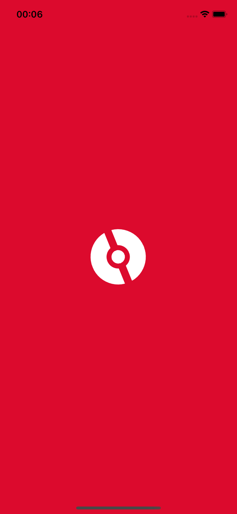
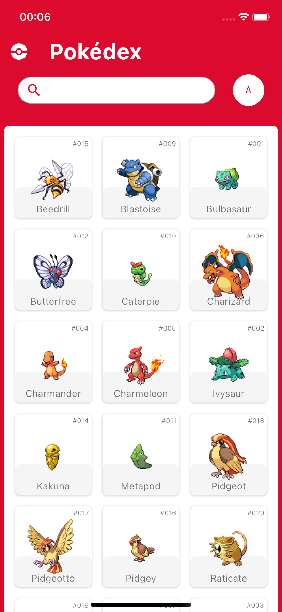
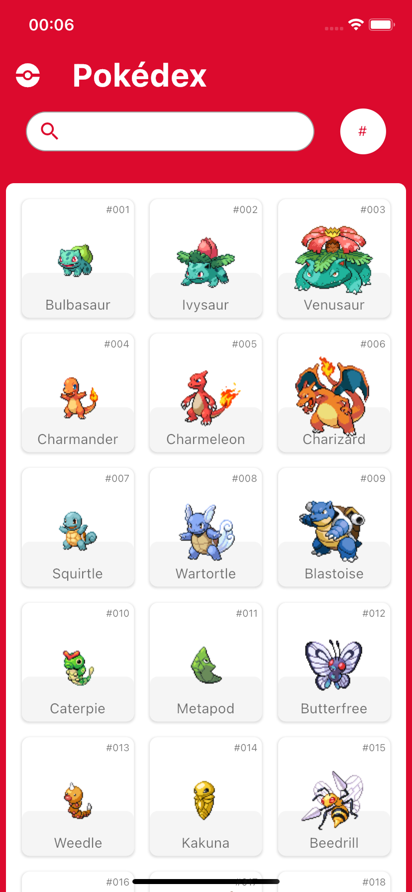
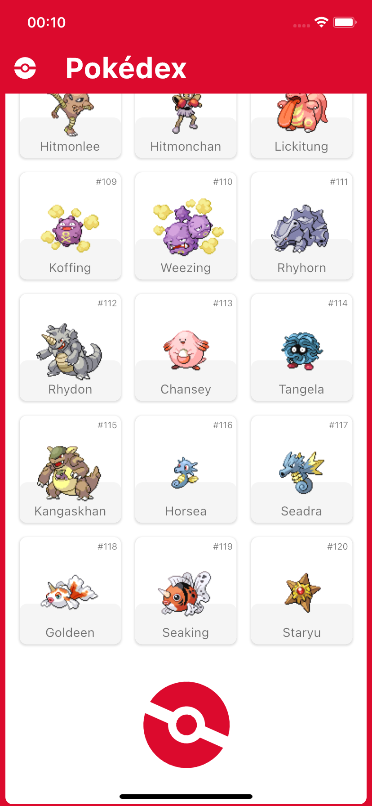
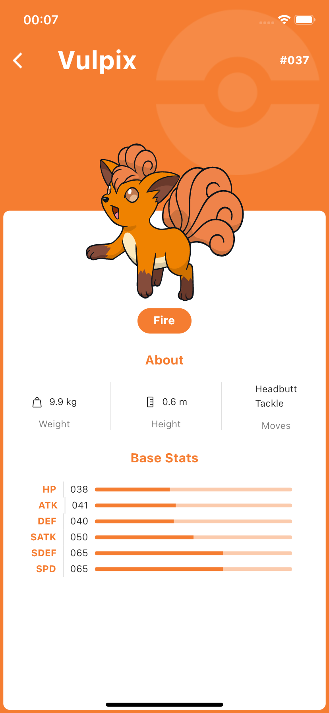
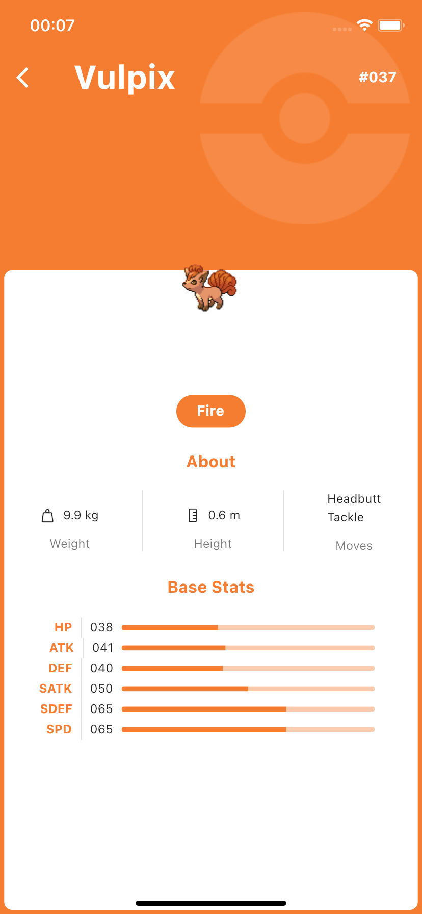
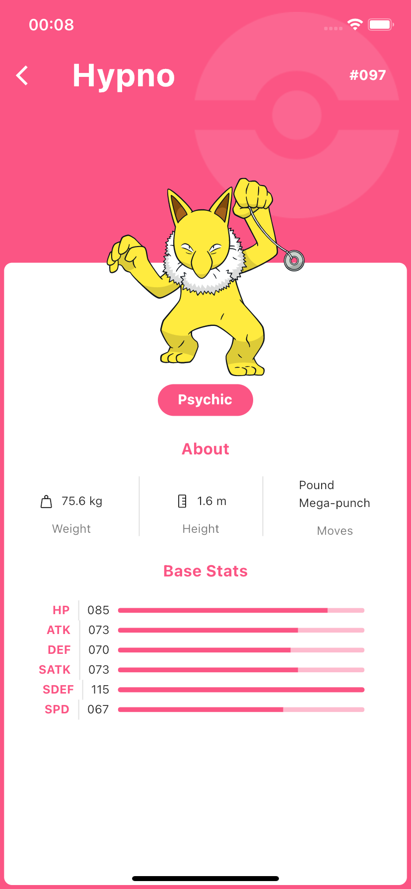
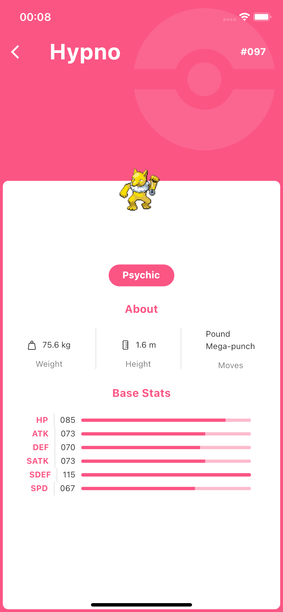

# pokedex_app

# 📁 Acesso ao projeto

Você pode baixar o arquivo zip ou utilizar o comando git clone para baixar o repositório.

# 🛠️ Abrir e rodar o projeto

Ao abrir o projeto na IDE é necessário rodar os comandos:

- <code>flutter pub get</code>
- <code>flutter run</code>

# Telas

|  |  |  |  |
| ----------- | ----------- | ----------- | ----------- |
| Splash | Ordenação por nome | Ordenação por número | Scroll Infinito |

|  |  |  |  |
| ----------- | ----------- | ----------- | ----------- |
| Detalhes do Pokemon | Placeholder para imagem que não carregou ainda | Detalhes do Pokemon (Cor Diferente a depender do tipo do pokemon) | Placeholder para imagem que não carregou ainda |
